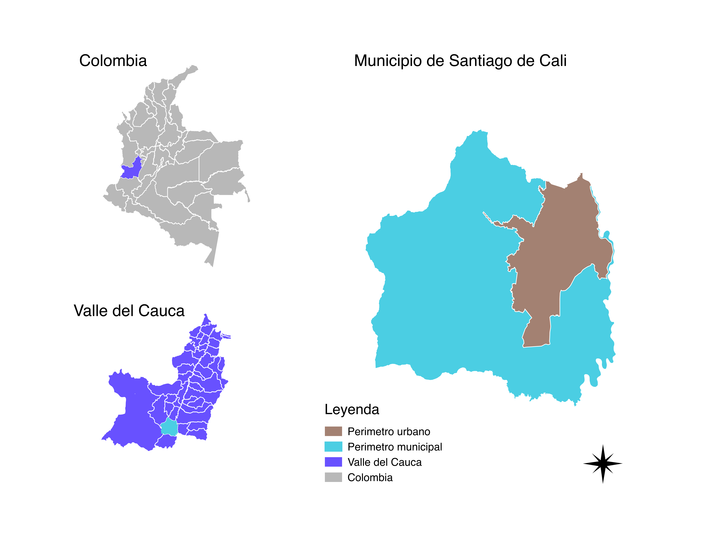

# Metodología {#meto}

```{r load-all, echo=FALSE}
#load("bck1.RData")
```


Este trabajo se concentra en indagar en particular sobre la justicia ambiental distributiva por medio de modelos estadísticos, geoestadísticos apoyados por el análisis visual de los patrones espaciales. El motivo principal para hacer uso de este tipo de aproximación pasa por la identificación de relaciones estadísticamente significativas entre variables sociales, económicas, estructurales y ambientales incluyendo la capacidad de detectar agrupaciones de unidades geográficas con características homogéneas donde intervenir y disminuir las inequidades en el acceso a servicios ambientales. 

Para ello se hará uso de datos del censo arbóreo de 2015^[ Desafortunadamente los datos del censo arbóreo no están disponibles al público general por motivos desconocidos, pues según la legislación Colombiana no existe ningún tipo de impedimento ni restricciones de privacidad sobre estos datos, que fueron recolectados con dineros públicos. Trabajé con una copia a la que tuve acceso por vínculos laborales con la Alcaldía de Cali], el censo de población del 2005^[Disponibles en [@censo_sistema_dane; @dane_cepal_celade_2005; @geoportal_DANE]] y aspectos estructurales del espacio público y privado de las unidades espaciales de análisis^[Disponibles en [@geoportal_idesc; @noauthor_plan_nodate]]. 

## Área de estudio

El municipio de Santiago de Cali se encuentra ubicado al suroccidente colombiano. Es la capital del departamento del Valle del Cauca y es la tercera ciudad más poblada del país, después de Bogotá y Medellín, con 2.420.114 habitantes según Cali en Cifras 2015[@escobar2015cali] . El municipio tiene un área 561.7 Km2, un área del perímetro urbano 120.4 Km2 (21.4 %).(Ver figura \@ref(fig:ubicacion)).La división administrativa de la zona urbana son comunas y las comunas se componen de barrios. 
 

```{r ubicacion, out.width='100%',echo=FALSE, fig.cap="Área de estudio"}

```


Santiago  de Cali presenta dos  zonas topográficas:  el valle del río Cauca hacia el oriente, el terreno más plano donde se ubica el casco urbano, y la zona de piedemonte hacia el occidente sobre la margen derecha de la cordillera Occidental. El área urbana limita al oeste y sur con el área rural del municipio, al este con el río Cauca y los municipios de Palmira y Candelaria, y al norte con el municipio de Yumbo.

El clima del municipio varía en relación al rango altitudinal que abarca entre 916 y 1,438 msnm. En la zona plana, se presenta un clima cálido con características semihúmedas hacia el sur y semiáridas hacia el norte mientras el piedemonte presenta condiciones de clima templado. La precipitación anual promedio es de 1.500 mm y la temperatura promedio anual es de 24 °C aproximadamente [@ciat_plan_2015]. La ciudad de Cali es de clima caliente, donde la sombra y la brisa son bien valoradas por sus habitantes. 


## Datos

### Datos de registros oficiales del municipio

La cartografía disponible en la Infraestructura de Datos Espaciales de Santiago de Cali, IDESC [@geoportal_idesc], incluye información sobre los objetos geográficos naturales, de infraestructura urbana, límites y divisiones político administrativas y la clasificación de predios en cuanto a espacio público disponibles en coordenadas planas del sistema [@noauthor_magna-sirgas-cali_nodate]. Además está la base de datos geográfica del Plan de Ordenamiento territorial de Cali 2014, POT2014^[Toda la información del POT2014 se encuentra en la web de la Alcaldía y puede descargarse como archivo GDB compatible con ArcGIS 10.4 o consumirse de Geoserver de IDESC como WFS o mapas en formato pdf del acuerdo]. Del POT2014 se seleccionaron conjuntos de datos de equipamientos y espacio público contenido en la estructura ecológica complementaria (ECC) que incluye cementerios, universidades, EV de acceso no restringido aunque algunos sea predios privados contenidos en EEC. De la IDESC se seleccionó la capa de barrios, espacio público, humedales, ríos y corredores ambientales disponibles vía WFS. La capa de manzanas es necesaria para refinar las capas de espacio verde y poder calcular el área de calle , área privada y otras métricas sobre la estructura de cada sector sector censal y que servirán como criterios para la selección de sectores urbanos a incluir en los análisis de regresión.

En la figura \@ref(fig:capas-idesc) se muestra un mapa con las capas seleccionadas para el realizar el procesamiento y los análisis.

```{r capas-idesc, out.width='100%',echo=FALSE, fig.cap="Capas usadas para el procesamiento de los espacios verdes y las características de las manzanas"}
knitr::include_graphics("QGIS/mapas/capas_analisis.png")
```


### El censo arbóreo 

En el año 2015 la ciudad de Santiago de Cali (Colombia) concretó la realización de un censo arbóreo que dejó como resultado una base de datos de aproximadamente 290.000 individuos censados. Los datos dan cuenta de la identificación de especies, sus características dasométricas, de emplazamiento y estado fitosanitario. Estos datos constituyen un insumo fundamental para para la caracterización de los beneficios y cargas que supone el mantenimiento y desarrollo del arbolado urbano. De hecho, su realización ocurre en el marco del proceso de formulación del plan silvicultura urbana o estatuto arbóreo^[ El proyecto de censo arbóreo se formuló en dos fases;  la primera se ejecutó mediante convenio No 095 de 2013 entre la CVC y la Universidad Autónoma de Occidente, y la segunda fase mediante convenio No 049 de 2014 entre las mismas entidades. Los datos no se encuentran publicados y fueron solicitados mediante un derecho de petición.] (Acuerdo 0335 de 2013). Las variables biofísicas recolectadas y la georeferenciación de los individuos permite agregar las características del arbolado a diferentes escalas de las unidades administrativas p.e divisiones censales, para identificar y caracterizar su distribución espacial y correlación con variables sociales o/y económicas. ALgunas de las variables incluidas en el censo se resumen en la tabla \@ref(tab:vars-AU) y en la tabla \@ref(tab:datos-ca2015).

Table: (#tab:vars-AU) Variables para caracterizar el AU

| variable | {valores}[unidades]     |
|-----:|---------------------------:|
|id_arbol|número entero único|
|diametro copa|[m^2^]|
|altura arbol|[m]|
|vitalidad|{`r levels(AU_analsis$vitalidad) %>% as.character %>% str_c(.,collapse =", ")`}|
|edad|{`r levels(AU_analsis$edad) %>% as.character %>% str_c(.,collapse =", ")`}|
|emplazamiento|{`r levels(AU_analsis$emplazamiento) %>% as.character %>% str_c(.,collapse =", ")`}|
|vegetación|{`r levels(AU_analsis$vegetacion) %>% as.character %>% str_c(.,collapse =", ")`}|
|Este|[m] MAGNA - SIRGAS-CALI|
| Norte | [m] MAGNA - SIRGAS-CALI|

```{r au-geo-emp,  fig.asp=1.5, fig.cap="Small multiples de los individuos arbóreos por emplazamiento",cache=TRUE}
# puntos por e,mplazamiento
base_plot.manzanas + geom_point(data = AU_analsis,
                                aes(x = Este, y = Norte),
                                size=0.01,
                                color="forestgreen",
                                alpha=0.1)+
  theme_void()+
  facet_wrap(~emplazamiento , ncol = 4 ,labeller = label_wrap_gen())

```

```{r datos-ca2015}
knitr::kable(head(AU_analsis[,c("id","vegetacion","edad","emplazamiento","diametro_copa","altura_arbol")]),caption = "Muestra de los datos del censo arbóreo",align = 'r')

```

Existe una diferencia de 10 años entre censo de población de 2005 y el censo arbóreo de la ciudad de Cali. Aunque esto pueda parecer una situación que reduce la legitimidad de los resultados que se hallen en este estudio, autores como @boone2010landscape y @schwarz_trees_2015 reconocen que los paisajes que vemos hoy son legados de patrones de consumo pasados, y que en el caso de la vegetación urbana tratamos con organismos de larga vida que pueden tardar mucho tiempo en establecerse y crecer. En contraste, la estructura social de las ciudades puede cambiar más rápidamente. 

Una apuesta para reducir la brecha es la exclusión de los árboles jóvenes del inventario, que posiblemente no estaban ahí en 2005. Aunque no conocemos las tasa anual de tala de árboles en la ciudad, y dado es posible que una parte importante de los árboles jóvenes haya reemplazado a los que fueron talados, no parece realista mantener el inventario entero. 

En general toda la vegetación aporta beneficios ambientales a los habitantes, en este estudio descartamos la vegetación arbustiva y los árboles, palmas y bambú de menos de 1.9 m de altura para circunscribirnos a los individuos más desarrollados. 

Una vez aplicado este filtro contamos con `r nrow(AU_analsis)` individuos.


###El censo de población

El último censo de población en Colombia se realizó en el año 2005, y los datos se pueden consultar y agregar en las diferentes unidades censales (sector, sección, manzana) usando una sistema de consulta web de censos Redatam^[El sistema de consulta es el [@cepal_redatam_nodate], que se puede acceder directamente desde [@dane_cepal_celade_2005] y en la página web del [DANE](http://www.dane.gov.co/index.php/estadisticas-por-tema/demografia-y-poblacion/censo-general-2005-1) dónde está organizada la documentación metodológica y otros servicios del censo.]. Estos datos sirven para caracterizar la población con base en indicadores y rasgos de las personas, aspectos sobre el uso del suelo y los tipos de vivienda. Las variables disponibles para el análisis están resumidas en las tablas \@ref(tab:vars-poblacion) y \@ref(tab:vars-vivienda). 

El otro componente de los datos es la cartografía censal del DANE [@geoportal_DANE] disponible para las diferentes unidades espaciales de agregación en el sistema de coordenadas WGS84. Para el análisis se tiene en cuenta todos las unidades censales que se interceptan con el perímetro urbano disponible en la IDESC, pues el censo arbóreo se limitó al este perímetro.(ver figura \@ref(fig:su-periurbano))


Table: (#tab:vars-poblacion) Variables sobre la población 

| variable | {valores}[unidades]    |
|-----:|---------------------------:|
|Pertenencia Étnica|[personas]{indígenas, ROM, gitanos, raizales del Archipiélago de San Andrés, Providencia y Santa Catalina, palenqueros de San Basilio, afrocolombianos}
|Con alguna limitación|[personas]{sí,no}
|Con estudios superior o postgrado|[personas] |
|Ningún estudio|[personas] |

```{r su-periurbano, out.width='100%',echo=FALSE, fig.cap="División en barrios y sectores urbanos de Santiago de Cali"}
knitr::include_graphics("images/sectoresurbanos_perimetro_idesc.png")
```

Table: (#tab:vars-vivienda) Variables sobre la las viviendas 

| variable | {valores}[unidades]    |
|-----:|---------------------------:|
|tipo vivienda|[viviendas] {Casa,Casa indígena,Apartamento,Tipo cuarto,Otro tipo de vivienda}|
|uso vivienda|[predio]{Uso Vivienda.Uso Unidad Económica,Uso LEA}|
|cantidad predios|[predios]|
|cantidad viviendas|[viviendas]|

Una de las apuestas del proyecto es incluir aspectos de los procesos de desarrollo urbano a través de la idea de barrio: como unidad de identidad cultural urbana y estructural, de características físicas y habitacionales en las que confluyen las transformaciones que hacen los habitantes y los diseños urbanos e intervenciones arquitectónicas de los planeadores y constructores en la ciudad. La unidad espacial de análisis sobre la cual se harán todas las agregaciones es el sector urbano (SU) de la cartografía censal 2005.


## Métodos y técnicas

El análisis propuesto se compone de las siguientes actividades:
 
1.  Preparación de los datos: una tarea común pero crucial para el análisis de datos. La estandarización de las variables categóricas y la identificación de valores atípicos o inconsistentes es una base firme para la estimación de parámetros y obtener soluciones confiables y sensibles de interpretación. Los datos suelen estar usualmente en formatos para la lectura humana o con distinta estructura de las variables de los modelos. La preparación de los datos consume la mayor parte de los esfuerzos de las tareas de procesamiento de los datos. Los datos del censo arbóreo se encuentra en tablas bien conformadas lo que facilita su manipulación. Los datos de consulta del censo de población vienen en tablas independientes para cada unidad espacial seleccionada, con diferentes longitud de variables. A esto se suma el componente espacial, donde hay que prestar particular atención a los sistemas de coordenadas y usar coordenadas planas consistentes con las unidades de espacio.
1.  Procesamiento y análisis estadístico: cálculo de indicadores de cobertura, acceso y variables socioeconómicas. Cálculo de estadísticos para probar normalidad, normalización de las variables e indicadores, cálculos de coeficientes de correlación Pearson y de Spearman entre todos los pares de variables.
1. Inspección visual de los datos: hacer uso de gráficas estadísticas, mapeos y mapas para evaluar y seleccionar los indicadores a usar en un modelo de regresión lineal. 
1. Evaluar los residuos usando la prueba de correlación espacial de Moran’I usando al menos dos diseños de matriz W. Si la prueba muestra una correlación y un valor de significancia alta, se prueban modelos tipo SAR, SEM o SLX para comparar su desempeño. 
1. Selección del modelo que mejor se ajusta usando métricas de error y de ajuste como R^2^ y el criterio de Akaike.


```{r diagrama-met}

```

### Procesamiento de datos 

El procesamiento de los datos se realizó  principalmente en @R-base. Se usó [QGIS](http://www.qgis.org/es/site/) para conectarse a los servicios WFS del IDESC y previsualizar las capas de información geográfica recolectada y la realización de algunos de los mapas detallados.

El código que implementa  los análisis está dividido en archivos para facilitar su lectura, cada uno de los cuales se encargan de transformar los datos de las fuentes y construir estructuras de datos necesarias para realizar las regresiones, las gráficas y los análisis de tipo estadístico y geoestadístico. Cada script implementa una fase de la metodología y produce resultados intermedios que facilitan seguir y reproducir dichas transformaciones sobre los datos de un dominio del problema. El archivo de `funciones.R` agrupa funciones que encapsulan funcionalidades recurrentes dentro del desarrollo del análisis. El script de `geodata.R` opera sobre los fuentes de datos geográficas necesarias para consolidar los índices de acceso a espacios verdes (EV),  los indicadores y variables de la estructura de física de los sectores censales y unidades geográficas del análisis. El script `arboles,R` consolida la información de cada uno de los individuos del censo arbóreo agregandolos por sector censal. El scrript `censopoblacion.R` consolida los datos del Censo de Población 2005. Los scripts `consolidarDatos.R` y `analisis_exploratorio.R` consolidan una única estructura con todos los datos y produce una serie de gráficas y medidas de correlación, que son base para la identificación de supuestos y selección de las variables independientes para los análisis estadísticos y las regresiones espaciales. Finalmente los script de `analisis_estadistico.R` y `analisis_geoestadistico.R` implementan las regresiones lineales y las regresiones espaciales respectivamente, así como los test y tablas para la verificación de los supuesto matemáticos y la verificación de la calidad de los resultados.  Todos estos están reunidos en un script que carga las librerías necesarias y ejecuta secuencialmente cada de los scripts descritos. 

Para usar la información geográfica de la cartografía censal y la información del IDESC es necesario establecer un sistema de coordenadas común, en unidades métricas, que facilite integrar la información y produzca resultados consistentes. El sistema de coordenadas proyectadas que vamos a usar es @noauthor_magna-sirgas-cali_nodate. Para cargar y manipular los datos espaciales hacemos uso de las librerías `rgdal` [@R-rgdal], `rgeos` [@R-rgeos] y `sp` [@R-sp]. 

El código y los datos están disponibles en este repositorio de GitHub.

### Cálculo de métricas de acceso a servicios ambientales

#### Indicadores de beneficios del arbolado urbano

Entre los distintos indicadores desarrollados para capturar la extensión y distribución de los servicios ambientales la cobertura de copas ha probado ser sensible y eficaz para cuantificar hasta qué punto los árboles y bosques están proporcionando servicios críticos a los residentes [@nowak_sustaining_2010].

En este trabajo usaremos dos variantes de la cobertura de copa:  el área de copa en metros^2^ (`area_copa`) y la cobertura de copa como porcentaje del área pública total (`cobertura_copa.ap`), conformada por la vías y calles más el área de espacio públicos) (ver figura \@ref(fig:mapa-copa-dep)).

```{r mapa-copa-dep, fig.cap="Sectores urbanos de las variables dependientes sobre cobertura de copa"}
su.f %>% dplyr::select(-area_su)  %>%
  left_join(dep.arboles.ntl.long,by = c("id"="SETU_CCDGO")) %>%
  filter(dep.arboles %in% dependientes.arboles) %>%
  ggplot()+
  geom_polygon(data = su.f, aes(x= long, y = lat, group = group), fill = "grey60")+
  geom_polygon(aes(x= long, y = lat, group = group, fill = factor(valores)))+
  coord_equal()+
  scale_fill_viridis( name = "deciles",
                      direction = 1, 
                      discrete = T, 
                      na.value = "grey50",
                      guide = guide_legend(direction = "horizontal",
                                           label.position = "bottom",
                                           title.position = 'top',
                                           nrow = 1))+
  facet_wrap(~dep.arboles, nrow = 1)+
  tema_lgnd_abajo()

```

#### Índices de acceso a espacios verdes

Para mejorar la lectura de esta sección se incluyen a continuación las ecuaciones que definen los índices de acceso seleccionados con las variantes definidas en este trabajo.

**índice contenedor porcentual** (area_ep.porcentaje)
\begin{equation}
A^{C_p}_i =1/a_i\sum_j{s_j} \;  \; \forall  j \in I
(\#eq:n-cont)
\end{equation}
donde $s_j$ es el área de cada espacio verde $j$ que pertenece al conjunto $I$ de EV dentro del sector $i$ y $a_i$ es el área del sector $i$.


**razón área disponible distancia** (ia.areas.dist)
\begin{equation}
\bar{A}^{AD}_i= \frac{\sum_{\int R_b }{s_j}}{\sum_{\int R_b }{d_{ij}}}  \;  \; \forall  j \in I_{R_b} \; 
(\#eq:areas-dists)
\end{equation}

donde $R_b$ es el radio de búsqueda,  $s_j$ es el área de cada espacio verde $j$, $d_{ij}$ es la distancia del centriode del sector $i$ al espacio $j$  que pertenecen al conjunto $I_{R_b}$ de EVs en el radio de búsqueda. 

Este índice muestran un dimensión relacionada no con solo con el acceso sino con la cantidad de espacio disponible en el radio de búsqueda definido desde el centroide del sector censal. Para hacernos una idea del radio de búsqueda seleccionado, el siguiente mapa muestra los radios búsqueda y los espacios verdes. 

```{r mapa-rango1km,  fig.asp=0.8, fig.cap="Espacio verdes y rango de 1 km desde centriodes de SU"}
ggplot()+
  geom_polygon(data = s_1000_df, 
               aes(x=long,y=lat,group=group),
               fill = "salmon",
               alpha = 0.2)+
  geom_path(data = su.f,aes(x=long,y=lat,group=group),
            color="grey40",
            size=0.4)+
  geom_polygon(data = ep.cali.f ,
               aes(x=long,y=lat,group=group),
               fill="royalblue",
               alpha=0.5)+
  coord_equal()+
  theme_void()
```

### Cálculo de métricas de sobre la población

#### Características de la población

La tabla \@ref(tab:vars-poblacion) resumen las variables consideradas inicialmente en este trabajo, sin embargo, algunas de ellas no contienen suficiente variabilidad o el número de individuos es muy bajo en comparación con el total de la población. En la tabla \@ref(tab:totales-poblacion) se observa el bajo número de personas que pertenecen al pueblo Rom (gitanos), Palenqueros de San Basilio (departamento de Bolívar) y de Raizales del Archipiélago de San Andrés, Providencia y Santa Catalina (SAI), por lo que son descartados del análisis al igual que la población indígena.

```{r totales-poblacion}
nombre_fila<-c("Población Total","Población afrodescendiente, negros o mulatos","Población indígena","Población Rom","Población Palenqueros","Población raizales de SAI")
tot_pob<-totales.cali[11:16] %>% as_vector(.,"numeric")
tabla.tmp<-data.frame(nombre_fila,unname(tot_pob))
knitr::kable(tabla.tmp, col.names = c("Tipo","Cantidad") ,caption = "Totales de población en la ciudad de Cali")

```

Las variables del censo de población seleccionadas para el análisis se muestran en la figura \@ref(fig:mapas-poblacion-deciles)

```{r mapas-poblacion-deciles, fig.asp=1.2,fig.cap="Mapas de las variables de población seleccionadas (en deciles)"}
su.f %>% dplyr::select(-area_su)  %>%
  left_join(metricas.poblacion.ntl.long, by = c("id"="SETU_CCDGO")) %>%
  filter(metricas.poblacion %in% metricas.poblacion[c(2,3,4,7)]) %>%
  ggplot()+
  geom_polygon(aes(x= long, y = lat, group = group, fill = factor(valores)))+
  coord_equal()+
  scale_fill_viridis( name = "deciles",
                      direction = 1, 
                      discrete = T, 
                      na.value = "grey50",
                      guide = guide_legend(direction = "horizontal",
                                           label.position = "bottom",
                                           title.position = 'top',
                                           nrow = 1))+
  facet_wrap(~metricas.poblacion, nrow = 2)+
  tema_lgnd_abajo()
```


Además de las variables seleccionadas podemos calcular indicadores como la densidad de población: dado que los árboles compiten por el espacio con los seres humanos es de esperarse que a mayor cantidad de personas haya menos lugar para los árboles. Podemos de nuevo calcular indicadores porcentuales respecto de la población total de cada unidad geográfica para facilitar la comparaciones y acentuar las diferencias entre los diferente sectores (figura \@ref(fig:mapas-poblacion-mod-deciles)).


```{r mapas-poblacion-mod-deciles, fig.asp=1.2,fig.cap="Mapas de las variables de población seleccionadas como porcentajes (en deciles)"}
su.f %>% dplyr::select(-area_su)  %>%
  left_join(metricas.poblacion.mod.ntl.long, by = c("id"="SETU_CCDGO")) %>%
  filter(metricas.poblacion.mod %in% metricas.poblacion.mod[c(1,2,3,5,6)]) %>%
  ggplot()+
  geom_polygon(aes(x= long, y = lat, group = group, fill = factor(valores)))+
  coord_equal()+
  scale_fill_viridis( name = "deciles",
                      direction = 1, 
                      discrete = T, 
                      na.value = "grey50",
                      guide = guide_legend(direction = "horizontal",
                                           label.position = "bottom",
                                           title.position = 'top',
                                           nrow = 1))+
  facet_wrap(~metricas.poblacion.mod, nrow = 2)+
  tema_lgnd_abajo()
```


#### Características de las viviendas

Además de las rasgos étnicos, condiciones de estudio y limitaciones de la población el censo de 2005 tiene disponibles datos sobre el tipo de viviendas (casa, apartamento, tipo cuarto, casa indígena, otros), y el uso habitacional, comercial y la cantidad de unidades especiales de alojamiento L.E.A dado a los predios. La vocación comercial o residencial de un barrio puede ser un factor en el desarrollo del arbolado urbano o de las disposiciones urbanísticas de la ciudad en relación a en EV, ya sea por las condiciones físicas como por la intervención de sus habitantes. Estas variables pueden también expresarse como porcentaje de la cantidad de predios de vivienda en el caso de los tipos o como porcentaje de la cantidad de predios en el caso del uso como unidad de vivienda, económica o L.E.A.

A continuación presentamos el resumen, los mapas por sector urbano (figuras \@ref(fig:mapas-usopredios-cont).

```{r mapas-usopredios-cont, fig.asp=0.8,fig.cap="Mapas de las variables sobre el tipo de uso de los predios como porcentaje de la cantidad de predios (escala contínua)"}

pl_poblacion<-plots_map_su_df(analisis.cali.df,metricas.predios[c(13:15)])
grid.arrange(grobs =pl_poblacion, nrow =1)

```


El uso de L.E.A tiene una distribución concentrada en uno pocos SU, por lo que podemos descartarla para los análisis de regresión. Existe también cierta complementariedad entre el uso de vivienda y los usos económicos de los predios, porque seguramente, si existe una correlación entre estas variables y la cobertura de copa o el acceso a espacios verdes una de las dos puede bastar para incluir esta dimensión en los modelos de regresión.

### Criterios y selección de sectores censales

Antes de iniciar un análisis de regresión establecemos los criterios para inclusión o no de ciertos datos dentro del conjunto de valores para la regresión y cálculo de la correlación. Estos criterios se listan a continuación:
 
- sectores sin personas
- sectores sin viviendas
- sectores área de espacio público mayor que el 60 % del área del sector
- sectores área de calle mayor que el 80 % del área del sector
- sectores área privada mayor que el 90 % del área del sector

Además de estos criterios se excluyeron los sectores donde está la Laguna el Pondaje, que cubre una porción muy importante del sector que no se ve reflejado en las otras métricas, los sectores con una porción mayor al 60% por fuera del perímetro urbano o sin urbanización visible en las imágenes satelitales. Así los sectores excluidos del análisis se muestran en los mapas \@ref(fig:mapa-excluidos). 

```{r mapa-excluidos, fig.cap="Mapa de los sectores excluidos"}
ggplot()+
   geom_polygon(data = su.f,
                aes(x = long ,y = lat, group = group),
                fill = "grey70")+
   geom_polygon(data = subset(su.f, id %in% su.exc$SETU_CCDGO),
                aes(x = long ,y = lat, group = group,fill = "descartados"),
                alpha = 0.5)+
   coord_equal()+
   scale_fill_manual(name ="SU",values = "blue")+
   theme_void()
```

### Selección de variables dependientes y regresiones lineales 

Las variables a incluir en los modelos lineales deben cumplir una serie de condiciones para ser elegidas como candidatas:

- *Mostrar una correlación fuerte* (típicamente mayor a 0.6 se considera una asociación fuerte).
- *Las variables independientes o predictoras no deben estar fuertemente correlacionadas entre ellas*.
- *Las observaciones deben ser independientes*. En nuestro caso significa que no debe existir relación espacial o temporal entre los diferentes sectores. Justamente esto se pondrá a prueba con los test estadísticos y los graficos de diagnostico sobre la distribución de los residuos de la regresión: se espera que dicha dependencia esté motivada por la vecindad de los sectores.
- *Las variables dependientes e independientes deben tener una distribución normal*. Esta condición no suele ser estricta, pues lo importante es que al calcular los coeficientes de la regresión obtengamos una distribución normal de los residuos (sin ningún patrón, ruido). De no ser así, es posible que las variables no sean independientes o que exista información significativa en los residuos, por ejemplo, porque existe autocorrelación espacial en la variable dependiente y entonces la regresión lineal no obtiene resultados confiables para los coeficientes.

La modelación inicia con el análisis con las variables sobre la población, que son las de mayor interés en un estudio dado su enfoque en la  justicia ambiental, para luego incorporar las variables de los dominios relacionados con el uso de los predios, los tipos de viviendas y la existencia de espacios verdes como parques, bulevares, escenarios deportivos o plazas, alojan una cantidad considerable de los individuos arbóreos de la ciudad.

Para garantizar que las variables no están correlacionadas entre sí, usaremos los coeficientes de correlación de Pearson, usado para detectar relaciones lineales, usualmente en variables con distribución normal, y el coeficiente de Spearman para detectar relaciones en variables con otras distribuciones o que exhiben relaciones no lineales. Para tener una idea más amplia sobre esa relación que expresan los coeficiente de correlación se incluyen gráficas de dispersión entre las variables independientes, y entre dependientes.

Para seleccionar las variables que mejor predicen la cobertura de copa aplicamos un procedimiento análogo al realizado con las variables dependientes entre sí. Con base en los coeficientes de correlación de Pearson y Spearman entre las variables dependientes e independientes, y teniendo en cuenta las restricciones de colinealidad entre las variables dependientes, seleccionamos las variables a usar en el modelo lineal.

Antes ajustar los modelos suele ser común en los modelos de regresión ajustar la distribución de las variables dependientes (y a veces las independientes) por motivos teóricos usando transformaciones logarítmicas o de raíz cuadra para eliminar no linealidades entre las variables dependientes y las independientes, y reducir posibles fenómenos de heterocedasticidad debido a estas no-linealidades. 

Dividir o multiplicar por alguna constante no tiene ningún efecto en la calidad de las estimaciones , pero sí sobre los coeficientes de la regresión. Esto suele ser sensible a la hora de interpretar los cambios marginales de cada una de las variables independientes y su efecto sobre la variable dependiente. Sin embargo, lo que interesa para este estudio no es la interpretación de esos cambio sino la importancia relativa de cada variable y comparar los cambios de los coeficientes de regresión para el ajuste de cada modelo y/o las mejoras que pueda operar un modelos autorregresivo en caso de encontrase autocorrelación en los residuos de la regresión lineal. Por esta razón, normalizar los valores puede ser una ventaja pues mantiene los coeficiente mejor acotados. La normalización se aplica posterior a las transformaciones propuestas y se realiza dividiendo por el máximo valor de los datos de cada variable para mantener valores en el intervalo [0,1], dado que los valores son todos iguales o mayores que 0.

Al aplicar test para verificar que las condiciones de un buen ajuste (no hay sesgos en el estimador o una mala especificación del modelo) de un modelo lineal se cumplen:

- La media de los residuos es 0 o muy cercana.
- La distribución de los residuos es normal.
- Los residuos muestran homocedasticidad (la varianza es constante)

Para verificar la normalidad de los residuos se hace uso del test de Shapiro–Wilk [@shapiro1965analysis ] y para la verificar si existe homocedasticidad el test de Breusch–Pagan [@breusch1979simple]. 

### Análisis geoestadísticos { #geostat }

Para los análisis geoestadísticos introducimos los modelos autoregresivos para obtener mejoras en la estimación de los coeficientes y en el ajuste de los modelo si existe algún tipo de autocorrelación espacial en los residuos. Existe una variedad de estos modelos que capturan diferentes tipos de efectos: modelo autoregresivo SAR que capturan efectos de la variable dependiente, ecuación \@ref(eq:sar) , sobre las variables las independientes ( spatial lag o retardo espacial en $X$ SLX, ecuación \@ref(eq:slx), en el error (modelo espacial del error SEM, ecuación \@ref(eq:sem) o usando una combinación del modelo de error y autoregresivo (modelo espacial de Durbin SD,ecuación \@ref(eq:sd). Todas estas aproximaciones introducen una matriz de $W_{n \times n}$, donde $n$ es el número de sitios, que captura la influencia de las variables en relación con su proximidad. Esta matriz $W$ es una estructura que restringe la influencia a priori en el modelo. Para observar el efecto que tiene esta matriz sobre los resultados del modelo usaremos 2 matrices distintas, y veremos su impacto en la estimación.

Para los análisis espaciales usaremos la librería `spdep` [@R-spdep]

#### Matrices de vecindad

La matriz $W$ representa la topología de vecindad entre los sectores censales. Existen la literatura diferentes tipos de vecindad: *rook*, *bishop* y *queen* son las más referenciadas. Esta vecindad está representada en la matriz con 1 cuando existe vecindad y 0 cuando no. Otra forma de cuantificar la interacción de esa vecindad es usando una matriz de inversos de la distancia entre los centroides de los sectores censales, con el fin de atenuar la interacción entre sectores muy alejados y tener una variable continua que representa esa influencia. En la figura \@ref(fig:w-su-todos) se muestra la matriz $W$ defina para vecinos que comparten un lado del polígono (vecindad *rook*) para todos los sectores de la ciudad de Cali.

```{r w-su-todos, fig.cap="Grafo de vecindad entre todos los SU de la ciudad de Cali"}
nb.su<-poly2nb(su, row.names = su$SETU_CCDGO)
par(mai=c(0,0,0,0))
plot(su, border="grey80")
plot(nb.su, coordinates(su), col='grey50', pch=19, cex=0.1,add=TRUE)
```

Sin embargo, la regresiones se realizan sobre un subconjunto de los datos, y por tanto la estructura de esta matriz debe tener esto en cuenta, o mejor, no tener en cuenta la influencia de estos sectores excluidos. Se calculó cada par de matrices de vecindad propuestas con base en el subconjunto de datos usados en los espacios verdes y para sectores del analsis del arbolado urbanos. Así la matriz de vecindad para los SU usados para la estimación de los coeficientes de las regresiones lineales se ve en la figura \@ref(fig:w-su-reg).

```{r w-su-reg, fig.cap="Grafo de vecindad entre los SU seleccionados para el análisis del AU"}

par(mai=c(0,0,0,0))
plot(su, border="grey80")
plot(W_cont, coordinates(su.arboles), col='orchid1',pch=19, cex=0.1, add=TRUE)
```

La matriz $W_d$ impone un estructura de interacciones que puede relacionar sectores en una zona que no necesariamente comparten ningún lado o esquina pero que están cercanos, mientras que $W_q$ se restringe a condiciones de vecindad sólo entre sectores contiguos. En esa medida puede existir juego para dar interpretación teórica al fenómeno de derrame o influencia que ejercen sobre el ajuste de los modelos. Un ejemplo puede ser que la dependencia espacial de las cobertura de árboles que expresa $W_d$ es una característica en una zona no limitada por las divisiones del territorio con base en los desarrollos urbanísticos (barrios) sino que se ajustan más a fenómenos de dispersión continuos con base en el alcance escogido. Así, la $W_q$ puede interpretarse como una forma de dar relevancia a la continuidad entre barrios y su importancia como unidad de desarrollo urbano en las variaciones de la variable a predecir. 


#### Autocorrelación espacial

Para indagar sobre la información o patrones espaciales de los residuos de los modelos de regresión usaramos el índice de Moran I. El índice de Moran I es el coeficiente de correlación para la relación entre una variable y sus valores circundantes. Si encontramos una correlación espacial significativa en los residuos, esto sugiere que agregando esa estructura en el modelo podremos obtener una estimación más eficiente de los coeficientes, y en consecuencia un mejor entendimiento de la relación entre esas variables. Hay que recordar que en este ejercicio no estamos queriendo entender una población por una muestra, estamos calculando estos coeficientes sobre el total de la población, y por tanto los coeficientes pueden interpretarse como la fuerza de esa relación. La confianza en esa estimación depende de que los residuos obtenidos sean tenga un valor medio de 0, y que no puedan distinguirse del ruido. La ecuación \@ref(eq:moranI) define matemáticamente el índice:


\begin{equation}
 I=\frac {N}{\sum _{i}\sum _{j}w_{ij}} \frac {\sum _{i}\sum _{j}w_{ij}(X_{i}-{\bar {X}})(X_{j}-{\bar {X}})}{\sum _{i}(X_{i}- \bar{X})^{2}}
(\#eq:moranI)
\end{equation}

donde $N$ es el número de unidades espaciales indexados por $i$ y  $j$; $X$ es la variable de interés; $\bar {X}$ es la media de $X$; y $w_{ij}$ es un elemento de una matriz de pesos espaciales $W$. Un valor de 0 de Moran’I indica un patrón espacial aleatorio. Si existe autocorrelación los valores son positivos y el máximo es 1. Si los valores son negativos decimos que existe dispersión, siendo -1 el mínimo valor posible representando la dispersión perfecta.

El gráfico de Moran es una forma de observar el valor de la pendiente (el índice de autocorrelación) graficando los valores retardados (spatial lag: es como dijimos previamente el valor medio de los valores vecinos) de la variable en cuestión en el eje $y$ y la variable en el $x$. El valor **$p$** del test estadístico nos dice qué tan seguros estamos que esa pendiente no es plana, por lo que se espera que sean menores que el valor límite de significancia $\alpha = 0.05$  

> El hecho de que de la Morán I es una suma de productos cruzados individuales es explotado por los "indicadores locales de asociación espacial" (LISA) para evaluar la agrupación de las unidades individuales mediante el cálculo de la I de Moran local para cada unidad espacial y la evaluación de la significación estadística para cada I. [@wikilisa]


Estos mapas acompaña el resultado numérico y el gráfico de Moran representan el valor z-normalizado del LISA, el valor $p$ y el mapa de clusters. En este último mapa las regiones resaltadas en rojo tienen valores altos de la variable y tienen vecinos con valores altos también (*high-high*). El área azul es *low-low* los grupos presentan valores bajos al igual que sus vecinos. Mientras que las regiones azul pálido son *low-high* y las áreas rosadas son *high-low* muestran correlación negativa, es decir valores muy diferentes a los de sus vecinos. Las regiones fuertemente coloreadas son aquellas que contribuyen significativamente a un resultado positivo de autocorrelación espacial global, mientras que los colores más claros contribuyen significativamente a un resultado de autocorrelación negativo.

#### Ajuste de modelos espaciales

Mejorar la especificación de los modelos lineales incluyendo términos de retardo espacial en la variable dependiente (SAR \@ref(eq:sar)) se hace para obtener una adecuada estimación de los coeficientes de las otras covariables en el modelo. Si optamos por un modelo de error espacial  (SEM \@ref(eq:sem)) implica que no es necesario plantear efectos distintivos de la variable dependiente rezagada, y que es posible que ese efecto sea por otras variables no tenidas en cuenta: el agrupamiento espacial observado en la variable dependiente se explica simplemente por el patrón geográfico de variables independientes medidas y no medidas. El modelo SAR, en cambio, incorpora la influencia de variables independientes no medidas, pero también estipula un efecto adicional de valores de atributos vecinos, es decir, la variable dependiente rezagada. 
Si incluimos el retardo sólo de las variables independientes (SLX \@ref(eq:slx)) esperamos que los cambios en las dimensiones expresadas con las predictores produce un efecto de derrame o influencia en los sectores vecinos. 

¿Qué significa decir que la cantidad de cobertura de copa está relacionada con la de los sectores vecinos?¿Son los procesos de reproducción del arbolado urbano un fenómeno independiente de las intervenciones de sus habitantes y de los urbanizadores?¿Los habitantes que ven árboles en las cuadras o barrios aledaños deciden sembrar árboles en su vecindario?¿Existen similitudes en las condiciones estructurales de los barrios en ciertas zonas de la ciudad que prefieren las personas con mejores condiciones sociales( tener estudios superiores p.e)?¿Qué tipo de pérdidas en la cobertura de copa están motivadas por la densificación de un sector? ¿Cómo afectan los cambios en los tipos de oferta habitacional en un sector la cobertura de copa de los sectores vecinos? (las viviendas tipo cuarto suelen ofrecerse en pensiones y ser más económicas que las casas o apartamentos).

La pregunta a hacerse es cómo saber cuál de los diferentes modelos espaciales es el que mejor representa el fenómeno que estamos modelando y si los datos respaldan nuestras convicciones teóricas. Si el modelo de retraso espacial que especifique es realmente el correcto, entonces ninguna dependencia espacial debe permanecer en los residuos, y podremos elaborar sobre el tipo de procesos que pueden verse representados.


Una alternativa metodológica es probar los 4 tipos de modelos con la matriz $W$ que resultó capturar mejor la asociación espacial en los datos y comparar sus resultados.
