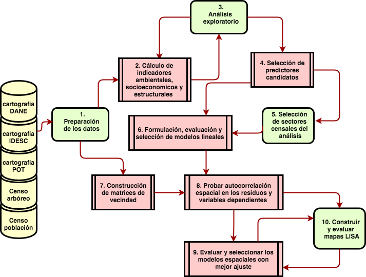

# Metodología {#meto}


## Área de estudio

El municipio de Santiago de Cali se encuentra ubicado al suroccidente colombiano, latitud 3.4372200°, longitud  -76.5225000° en grados decimales del sistema de coordenadas WGS84 (ver figura \@ref(fig:mapa-area)). Es la capital del departamento del Valle del Cauca y es la tercera ciudad más poblada del país, después de Bogotá y Medellín, con 2,420,114 habitantes según la proyección de población para 2017 de Cali en Cifras 2015 [@escobar2015cali]. El municipio tiene un área 561.7 Km2, un área del perímetro urbano 120.4 Km2 (21.4 %). La división administrativa de la zona urbana son comunas y las comunas se componen de barrios. 

Santiago  de Cali presenta dos  zonas topográficas:  el valle del río Cauca hacia el oriente, el terreno más plano donde se ubica el casco urbano, y la zona de piedemonte hacia el occidente sobre la margen derecha de la cordillera Occidental. El área urbana limita al oeste y sur con el área rural del municipio, al este con el río Cauca y los municipios de Palmira y Candelaria, y al norte con el municipio de Yumbo.

El clima del municipio varía en relación al rango altitudinal que abarca entre 916 msnm en la zona geográfica del río Cauca y hasta los 4,070 msnm en el Parque Nacional Natural Los Farallones [@ciat_plan_2015]. En la zona plana, se presenta un clima cálido con características semihúmedas hacia el sur y semiáridas hacia el norte mientras el piedemonte presenta condiciones de clima templado [@ciat_microzona_2015]. La precipitación anual promedio es de 1,500 mm y la temperatura promedio anual es de 24 °C aproximadamente [@ciat_plan_2015]. La ciudad de Cali es de clima caliente, donde la sombra y la brisa son bien valoradas por sus habitantes. 


```{r mapa-area,fig.cap="Área de estudio. Perímetro urbano de Santiango de Cali", fig.height=6, out.width="90%"}

g1 <- OSMap+
  geom_path(data=prmtr_urbn_idesc.wgs.df,  
            aes(long,lat,group=group,color="Perímetro"), fill="none") +
  coord_equal() +
  scale_color_manual("Perimetro", values = "red")+
  theme(legend.position = c(0.9, 0.25))+
  ggsn::north(prmtr_urbn_idesc.wgs.df, symbol = 3, scale = 0.1, location = "topleft") +
  ggsn::scalebar(prmtr_urbn_idesc.wgs.df, dist = 2, dd2km = TRUE, model = 'WGS84',st.size = 4)+
  labs(
    # title ="Zona Urbana de Santiago de Cali", 
    x = "Long", y="Lat",
    caption="Datos en grados decimales, sistema de coordenas WGS84\nDatos: IDESC"
    )

g2 <-ggplot(colombia_continental_f,aes(x=long,y=lat,group=group))+
    geom_polygon(fill="lightgrey",color="white",size = 0.2)+
    geom_point( y=3.359889,x= -76.638565, color = "red",size = 1)+
    coord_map()+
    theme_void()+
    theme(panel.background = element_rect(fill = "white"))

grid.newpage()
vp1 <- viewport(width = 1, height = 1, x = 0.5, y = 0.5)  # the larger map
vp2 <- viewport(width = 0.15, height = 0.2, x = 0.3, y = 0.24)  # the inset in upper right
print(g1, vp = vp1)
print(g2, vp = vp2)


```


## Datos

Se hizo uso de datos del Censo Arbóreo de 2015 (CA2015) [@ca2015cali], el Censo de Población de 2005 (CP2005) [@censo_sistema_dane; @geoportal_DANE] y aspectos estructurales del espacio público y privado de las unidades espaciales de análisis tomados de la Infraestructura de Datos Espaciales de Santiago de Cali (IDESC) [@geoportal_idesc] y las bases de datos del Plan de Ordenamiento Territorial (POT) del 2014 [@pot2014cali]. 

### Datos de registros oficiales del municipio

La cartografía disponible en la IDESC [@geoportal_idesc], incluye información sobre los objetos geográficos naturales, de infraestructura urbana, límites y divisiones político administrativas y la clasificación de predios en cuanto a espacio público disponibles en coordenadas planas del sistema MAGNA-SIRGAS-CALI [@igagMC2005]. Además está la base de datos geográfica del POT [@pot2014cali]. Se seleccionaron conjuntos de datos de equipamientos y espacio público contenido en la estructura ecológica complementaria (EEC) que incluye cementerios, universidades, EV de acceso no restringido aunque algunos sea predios privados contenidos en EEC. De la IDESC se seleccionaron las capas de manzanas, barrios, espacio público, humedales, ríos y corredores ambientales, todas disponibles vía *Web Feature Service* (WFS). En la figura \@ref(fig:capas-idesc) se muestra un mapa con las capas seleccionadas para el realizar el procesamiento y los análisis.

```{r capas-idesc, out.width='100%',echo=FALSE, fig.cap="Capas usadas para el procesamiento de los espacios verdes y las características de las manzanas"}
knitr::include_graphics("QGIS/mapas/capas_analisis.png")
```


### El censo arbóreo 

En el año 2015 la ciudad de Santiago de Cali concretó la realización del censo arbóreo (CA2015) que dejó como resultado una base de datos de `r total_arboles_censo %>% scales::comma()` individuos censados [@ca2015cali]. Los datos dan cuenta de la identificación de especies, georeferenciación de los individuos, sus características dasométricas, de emplazamiento y estado fitosanitario. Las variables contenidas en ese estudio se resumen en la tabla \@ref(tab:vars-AU).

Table: (#tab:vars-AU) Variables para caracterizar el AU

| variable | {valores}[unidades]     |
|----------------------|-------------------------------|
|id_arbol|número entero único|
|diametro copa|[m^2^]|
|altura arbol|[m]|
|vitalidad|{`r levels(AU_analsis$vitalidad) %>% as.character %>% str_c(.,collapse =", ")`}|
|edad|{`r levels(AU_analsis$edad) %>% as.character %>% str_c(.,collapse =", ")`}|
|emplazamiento|{`r levels(AU_analsis$emplazamiento) %>% as.character %>% str_c(.,collapse =", ")`}|
|vegetación|{`r levels(AU_analsis$vegetacion) %>% as.character %>% str_c(.,collapse =", ")`}|
|Este|[m] MAGNA - SIRGAS-CALI|
| Norte | [m] MAGNA - SIRGAS-CALI|


Existe una diferencia de 10 años entre censo de población de 2005 y el censo arbóreo de la ciudad de Cali. Aunque esto pueda parecer una situación que reduce la legitimidad de los resultados que se hallen en este estudio, autores como @boone2010landscape y @schwarz_trees_2015 reconocen que los paisajes que vemos hoy son legados de patrones de consumo pasados, y que en el caso de la vegetación urbana tratamos con organismos de larga vida que pueden tardar mucho tiempo en establecerse y crecer. En contraste, la estructura social de las ciudades puede cambiar más rápidamente. 

Atendiendo a estos argumentos se excluyó de la base de datos del CA2015 árboles jóvenes del inventario, que no estaban ahí en 2005. Aunque toda la vegetación aporta beneficios ambientales a los habitantes, en este estudio se descartó la vegetación arbustiva y los árboles, palmas y bambú de menos de 1.9 m de altura para circunscribirse a los individuos más desarrollados. 

Una vez aplicado este filtro se cuenta con `r nrow(AU_analsis) %>% scales::comma()` individuos.


### El censo de población

Los datos del CP2005 están disponibles en las unidades censales (sector, sección, manzana) a través del sistema de consulta web [@censo_sistema_dane]. Estos datos sirven para caracterizar la población con base en indicadores sobre rasgos de las personas, aspectos sobre el uso del suelo y los tipos de vivienda. Las variables disponibles para el análisis están resumidas en las tablas \@ref(tab:vars-poblacion) y \@ref(tab:vars-vivienda). 

El otro componente de los datos es la cartografía censal del DANE [@geoportal_DANE] disponible para las diferentes unidades espaciales de agregación en el sistema de coordenadas WGS84. Para el análisis se tiene en cuenta todos las unidades censales que se interceptan con el perímetro urbano disponible en la IDESC, pues el censo arbóreo se limitó a este perímetro.(ver figura \@ref(fig:su-periurbano))


Table: (#tab:vars-poblacion) Variables sobre la población 

| variable |  {valores}[unidades]    |
|--------------|--------------------------------|
|Pertenencia Étnica|[personas]{indígenas, ROM, gitanos, raizales del Archipiélago de San Andrés, Providencia y Santa Catalina, palenqueros de San Basilio, afrocolombianos}
|Con alguna limitación|[personas]{sí,no}
|Con estudios superior o postgrado|[personas] |
|Ningún estudio|[personas] |


Table: (#tab:vars-vivienda) Variables sobre la las viviendas 

| variable | {valores}[unidades]    |
|-----------------|---------------------------|
|tipo vivienda| {Casa,Casa indígena,Apartamento,Tipo cuarto,Otro tipo de vivienda}[viviendas] |
|uso vivienda|{Uso Vivienda.Uso Unidad Económica,Uso LEA}[predios]|
|cantidad predios|[predios]|
|cantidad viviendas|[viviendas]|

La unidad espacial de análisis sobre la cual se harán todas las agregaciones es el sector urbano (SU) de la cartografía censal 2005.


```{r su-periurbano, out.width='90%',echo=FALSE, fig.cap="Sectores urbanos y périmetro urbano de Santiago de Cali"}

ggplot()+
  geom_path(data =su.f,
            aes(x=long, y=lat, group = group,color = "Sectores Urbanos"))+
  geom_path(data =prmtr_urbn_idesc.df,
            aes(x=long, y=lat, group = group, color = "Perímetro Urbano"))+
  coord_equal()+
  ggsn::north(prmtr_urbn_idesc.df, symbol = 3, scale = 0.1, location = "topleft") +
  ggsn::scalebar(prmtr_urbn_idesc.df, dist = 2, st.size = 3)+
  scale_color_manual(name = NULL, values = c("red","lightblue"))+
  theme_void()


# 
```


## Métodos y técnicas

Este trabajo se concentró en indagar en particular sobre la justicia ambiental distributiva por medio de modelos estadísticos de regresión y geoestadísticos usados ampliamente en la literatura revisada [@heynen_political_2006;@vasquez_fuentes_vegetacion_2008;@landry_street_2009;@gibbons_mostly_2012;@zhou_social_2013;@shanahan_socio-economic_2014;@lesage_biggest_2014;@schwarz_trees_2015;@PACHECO2013121]. Se busca probar que existe un sesgo en la distribución de un beneficio ambiental (AU y EV) explicado por alguna variable socioeconómica o estructural. Desde la modelación estadística esto se logra encontrando predictores con coeficientes significativos en la regresión lineal. Si exsite un patrón espacial que puede ser includo en la modelación para mejorar la estimación de los coeficiente de la regresión, su inclusión debe mejorar las condiciones de normalidad y homocedasticidad de los residuos de la regresión.   

Para detectar agrupaciones de unidades geográficas con características homogéneas donde intervenir y disminuir las inequidades en el acceso a servicios ambientales se complementan los análisis con el uso de mapas de LISA [@talen_assessing_1998]. 


El diagrama de la figura \@ref(fig:flujograma) sintetiza el análisis propuesto, compuesto de las siguientes actividades:
 
1.  Preparación de los datos: construcción de tablas, estandarización de las variables categóricas, sistemas de coordenadas y la identificación de valores atípicos o inconsistentes en los datos.
1.  Procesamiento y análisis estadístico: cálculo de indicadores de cobertura, acceso y variables socioeconómicas. Cálculo de estadísticos para probar normalidad, normalización de las variables e indicadores, cálculos de coeficientes de correlación Pearson y de Spearman entre todos los pares de variables.
1. Análisis exploratorio: hacer uso de gráficas estadísticas, mapeos y mapas para evaluar y seleccionar los indicadores a usar en un modelo de regresión lineal. 
1. Seleccionar los mejores predictores con base en coeficientes de correlación.
1. Seleccionar los SU a incluir con base la coincidencia con las capas de AU y EV.
1. Construir y evaluar los modelos de regresión lineal.
1. Contruir matrices de vencidad $W$ para incluir restricciones espaciales al modelo.
1. Probar autocorrelación espacial usando Moran’I en los residuos de los modelos de regresión lineal con dos diseños de matriz $W$. Si la prueba muestra una correlación y un valor de significancia alta, se prueban modelos tipo SAR, SEM o SD para comparar su desempeño. 
1. Selección del modelo que mejor se ajusta usando métricas de error y de ajuste como R^2^ y el criterio de Akaike.
1. Graficar mapas de LISA para caraterizar los patrones de agrupación de las varobles del los modelos mejor ajustados.


```{r flujograma, out.width='100%',echo=FALSE, fig.cap="Diagrama de flujo de la metodología"}

```

### Procesamiento de datos 

El procesamiento de los datos se realizó principalmente en R [@R-base]. Se usó [QGIS](http://www.qgis.org/es/site/) para conectarse a los servicios WFS del IDESC y previsualizar las capas de información geográfica recolectada y la realización de algunos de los mapas detallados. Para cargar y manipular los datos espaciales se hizo uso de las librerías `rgdal` [@R-rgdal], `rgeos` [@R-rgeos] y `sp` [@R-sp]. En el anexo \@ref(rinfo) se encuentra la información completa de la sesión de R. 


El código que implementa los análisis está dividido en archivos para facilitar su lectura, cada uno de los cuales se encargan de transformar los datos de las fuentes y construir estructuras de datos necesarias para realizar las regresiones, las gráficas y los análisis de tipo estadístico y geoestadístico. 

El código y los datos están disponibles en el [repositorio de GitHub](https://github.com/correajfc/R-CP2005-CA2015) en https://github.com/correajfc/R-CP2005-CA2015. 

### Cálculo de métricas de acceso a servicios ambientales

#### Indicadores de beneficios del arbolado urbano

Entre los distintos indicadores desarrollados para capturar la extensión y distribución de los servicios ambientales, la cobertura de copas ha probado ser sensible y eficaz para cuantificar hasta qué punto los árboles y bosques están proporcionando servicios críticos a los residentes [@nowak_sustaining_2010].

En este trabajo se usaron dos variantes de la cobertura de copa, una de orden global y otra local respectivamente:  el área de copa en metros^2^ (`area_copa`) y la cobertura de copa como porcentaje del área pública total (`cobertura_copa.ap`), conformada por la vías y calles más el área de espacio públicos) (ver figura \@ref(fig:mapa-copa-dep)).

```{r mapa-copa-dep,fig.asp=0.62, fig.cap="Sectores urbanos de las variables dependientes sobre cobertura de copa", out.width="70%"}
su.f %>% dplyr::select(-area_su)  %>%
  left_join(dep.arboles.ntl.long,by = c("id"="SETU_CCDGO")) %>%
  filter(dep.arboles %in% dependientes.arboles) %>%
  mutate(dep.arboles = reemplzar_nombres_vector(dep.arboles,df_nombres_variables)) %>% 
  ggplot()+
  geom_polygon(data = su.f, aes(x= long, y = lat, group = group), fill = "grey60")+
  geom_polygon(aes(x= long, y = lat, group = group, fill = factor(valores)))+
  coord_equal()+
  scale_fill_viridis( name = "deciles",
                      direction = 1, 
                      discrete = T, 
                      na.value = "grey50",
                      guide = guide_legend(direction = "horizontal",
                                           label.position = "bottom",
                                           title.position = 'top',
                                           nrow = 1))+
  facet_wrap(~dep.arboles, nrow = 1)+
  tema_lgnd_abajo(plot.caption=element_text(size=7, hjust = 1))+
  labs(caption = "Datos:CA2015")

```

#### Índices de acceso a espacios verdes

En este estudio se usaron dos métricas de acceso a espacios verdes. El primero es el índice contenedor porcentual (ecuación \@ref(eq:n-cont)), catalogado como una medida de acceso local a la unidad espacial de análisis, ampliamente usado en la literatutra [@talen_assessing_1998].

**índice contenedor porcentual** (area_ep.porcentaje)
\begin{equation}
A^{C_p}_i =1/a_i\sum_j{s_j} \;  \; \forall  j \in I
(\#eq:n-cont)
\end{equation}
donde $s_j$ es el área de cada espacio verde $j$ que pertenece al conjunto $I$ de EV dentro del sector $i$ y $a_i$ es el área del sector $i$.


El segundo índice (ecuación \@ref(eq:areas-dists)) es una propuesta de este estudio basada en el trabajo de @nesbitt_exploring_2016 en el que se calcula la distancia euclide a los EV desde el centroide de la unidad de análisis, incorporando recomendaciones de la Organización Mundial de la Salud sobre establacer la relación entre distancia y calidad del acceso usando el área del EV [@who2016urban] y los índice propuestos por  @zhou_social_2013 de un radio de búsqueda de EVs accesibles, sin importar si este está dentro de la unidad espacial a caraterizar.  

Este índice define el acceso como una relación entre la distancia y la cantidad de espacio disponible en el radio de búsqueda definido desde el centroide del SU. La figura \@ref(fig:mapa-rango1km) muestra gráficamente como existen EVs que caen la intersección de los radios de búsqueda de multiples sectores urbanos, lo que implica que benefician a varios de ellos a la vez, y es por esa razón que el índice expresa una dimensión del acceso no confinada a la unidad espacial. 

**razón área disponible distancia** (ia.areas.dist)
\begin{equation}
\bar{A}^{AD}_i= \frac{\sum_{\int R_b }{s_j}}{\sum_{\int R_b }{d_{ij}}}  \;  \; \forall  j \in I_{R_b} \; 
(\#eq:areas-dists)
\end{equation}

donde $R_b$ es el radio de búsqueda,  $s_j$ es el área de cada espacio verde $j$, $d_{ij}$ es la distancia del centriode del sector $i$ al espacio $j$  que pertenecen al conjunto $I_{R_b}$ de EVs en el radio de búsqueda. 


```{r mapa-rango1km,  fig.asp=1, out.width="70%",fig.cap="Espacios verdes y radio de búsqueda de 1 km desde los centriodes del SU"}
ggplot()+
  geom_polygon(data = s_1000_df, 
               aes(x=long,y=lat,group=group,fill = "radio búsqueda"),
               alpha = 0.1)+
  geom_path(data = su.f,aes(x=long,y=lat,group=group),
            color="grey40",
            size=0.4)+
  geom_polygon(data = ep.cali.f ,
               aes(x=long,y=lat,group=group,fill="EV"),
               alpha=0.7)+
  scale_fill_manual(name =" ",values = c("forestgreen","salmon"))+
  coord_equal()+
  theme_void()+
  theme(plot.caption=element_text(size=6, hjust = 1), 
        legend.key.size = unit(3,units = "mm"),
        legend.text = element_text(size = 6),
        legend.title = element_text(size = 6))+
  ggsn::north(su.f, symbol = 3, scale = 0.1, location = "topleft") +
  ggsn::scalebar(su.f, dist = 2, st.size = 2.5)+
  labs(caption = "Fuente:IDESC, POT2014")
```

### Cálculo de métricas sobre la población

#### Características de la población

La tabla \@ref(tab:vars-poblacion) muestra los valores de la variable de etnicidad. Al hacer los conteos por pertencia a un grupo etnico para toda la ciudad (ver tabla \@ref(tab:totales-poblacion)), se observa el bajo número de personas que pertenecen al pueblo Rom (gitanos), Palenqueros de San Basilio (departamento de Bolívar) y de Raizales del Archipiélago de San Andrés, Providencia y Santa Catalina (SAI) y a la población indígena, por lo que son descartados del análisis.

```{r totales-poblacion}
nombre_fila<-c("Población Total","Población afrodescendiente, negros o mulatos","Población indígena","Población Rom","Población Palenqueros","Población raizales de SAI")
tot_pob<-totales.cali[11:16] %>% as_vector(.,"numeric")
tabla.tmp<-data.frame(nombre_fila,unname(tot_pob)) %>% 
  mutate_if(.predicate =  is.numeric,.funs =  scales::comma)
knitr::kable(format = formato_render,      
             booktab = T,tabla.tmp, col.names = c("Tipo","Cantidad") ,caption = "Totales de población por grupo étnico en la ciudad de Cali")

```

Las variables del CP2005 seleccionadas para el análisis se muestran en la figura \@ref(fig:mapas-poblacion-deciles).

```{r mapas-poblacion-deciles, fig.width=5,fig.height=6,fig.cap="Mapas de las variables de población seleccionadas (en deciles).", fig.pos = 'p', out.width="70%"}
su.f %>% dplyr::select(-area_su)  %>%
  left_join(metricas.poblacion.ntl.long, by = c("id"="SETU_CCDGO")) %>%
  filter(metricas.poblacion %in% metricas.poblacion[c(2,3,4,7)]) %>%
  mutate(metricas.poblacion = reemplzar_nombres_vector(metricas.poblacion,df_nombres_variables)) %>% 
  ggplot()+
  geom_polygon(aes(x= long, y = lat, group = group, fill = factor(valores)))+
  coord_equal()+
  scale_fill_viridis( name = "deciles",
                      direction = 1, 
                      discrete = T, 
                      na.value = "grey50",
                      guide = guide_legend(direction = "horizontal",
                                           label.position = "bottom",
                                           title.position = 'top',
                                           nrow = 1))+
  facet_wrap(~metricas.poblacion, ncol = 2 )+
  tema_lgnd_abajo(plot.caption=element_text(size=6, hjust = 1),                                         
                  strip.text = element_text(size = 6),
                  legend.key.size = unit(3,units = "mm"),
        legend.title = element_text(size = 6)
        )+
  labs(caption = "Datos:CP2005")

```


Además de las variables seleccionadas se calculó la densidad de población dado que los árboles compiten por el espacio con los seres humanos y es de esperar que a mayor cantidad de personas haya menos lugar para los árboles. Se calcularon indicadores porcentuales respecto de la población total de cada unidad geográfica para facilitar la comparaciones y acentuar las diferencias entre los SU (figura \@ref(fig:mapas-poblacion-mod-deciles)).


```{r mapas-poblacion-mod-deciles, fig.asp=1.2,fig.cap="Mapas de las variables de población seleccionadas como porcentajes (en deciles)",out.width="90%"}
su.f %>% dplyr::select(-area_su)  %>%
  left_join(metricas.poblacion.mod.ntl.long, by = c("id"="SETU_CCDGO")) %>%
  filter(metricas.poblacion.mod %in% metricas.poblacion.mod[c(1,2,3,5,6)]) %>%
   mutate(metricas.poblacion.mod = reemplzar_nombres_vector(metricas.poblacion.mod,df_nombres_variables)) %>% 
  ggplot()+
  geom_polygon(aes(x= long, y = lat, group = group, fill = factor(valores)))+
  coord_equal()+
  scale_fill_viridis( name = "deciles",
                      direction = 1, 
                      discrete = T, 
                      na.value = "grey50",
                      guide = guide_legend(direction = "horizontal",
                                           label.position = "bottom",
                                           title.position = 'top',
                                           nrow = 1))+
  facet_wrap(~metricas.poblacion.mod, nrow = 2)+
  tema_lgnd_abajo(plot.caption=element_text(size=6, hjust = 1),                                         
                  strip.text = element_text(size = 7),
                  legend.key.size = unit(3,units = "mm"),
        legend.title = element_text(size = 6)
        )+
  labs(caption = "Datos:CP2005")


```


#### Características de las viviendas

Además de las rasgos étnicos, condiciones de escolaridad y limitaciones de la población, el CP2005 tiene disponibles datos sobre el tipo de viviendas (casa, apartamento, tipo cuarto, casa indígena, otros), y el uso habitacional, comercial y la cantidad de lugares especiales de alojamiento^[Corresponden a las diferentes unidades que desempeña una función de interés público, que puede ser benéfico o docente] (LEA) dado a los predios. La vocación comercial o residencial de un barrio puede ser un factor en el desarrollo del arbolado urbano o de las disposiciones urbanísticas de la ciudad en relación a EVs, ya sea por las condiciones físicas como por la intervención de sus habitantes. Estas variables pueden también expresarse como porcentaje de la cantidad de predios de vivienda según los tipos o como porcentaje de la cantidad de predios según su uso: vivienda, unidad económica o LEA. La variable LEA presenta una distribución uniforme, por lo que se descarta para los análisis de regresión (ver los gráficos por sector urbano en la figura \@ref(fig:mapas-usopredios-cont).

```{r mapas-usopredios-cont, fig.asp=1.2,out.width="80%",fig.cap="Mapas de las variables sobre el tipo de uso de los predios como porcentaje de la cantidad de predios (escala contínua)"}

pl_poblacion<-plots_map_su_df(analisis.cali.df,
                              metricas.predios[c(11,13:15)],
                              strip.text = element_text(size = 6),
                              legend.title = element_text(size = 7))

pl_poblacion[[1]]$labels$fill <- reemplzar_nombres_vector(pl_poblacion[[1]]$labels$fill,df_nombres_variables)
pl_poblacion[[2]]$labels$fill <- reemplzar_nombres_vector(pl_poblacion[[2]]$labels$fill,df_nombres_variables)
pl_poblacion[[3]]$labels$fill <- reemplzar_nombres_vector(pl_poblacion[[3]]$labels$fill,df_nombres_variables)
pl_poblacion[[4]]$labels$fill <- reemplzar_nombres_vector(pl_poblacion[[4]]$labels$fill,df_nombres_variables)


grid.arrange(grobs =pl_poblacion, nrow =2,
             bottom = textGrob( label = "Fuente:CP2005", 
                                hjust = 1, x = 0.9,
                                gp=gpar(fontsize=6))  
             )

```


### Criterios y selección de sectores censales

Se establecieron criterios para la **exclusión** de datos para el análisis de regresión que evitan incluir SUs atípicos:
 
- sectores sin personas
- sectores sin viviendas
- sectores con área de espacio público mayor que el 80 % del área del sector
- sectores con área de calle mayor que el 80 % del área del sector
- sectores área privada mayor que el 90 % del área del sector
- sectores con una porción mayor al 60% por fuera del perímetro urbano

Los sectores excluidos del análisis se muestran en los figura \@ref(fig:mapa-excluidos). 

```{r mapa-excluidos, fig.cap="Sectores excluidos", fig.asp=1, out.width="60%"}
ggplot()+
   geom_polygon(data = su.f,
                aes(x = long ,y = lat, group = group),
                fill = "grey70")+
   geom_polygon(data = subset(su.f, id %in% su.exc$SETU_CCDGO),
                aes(x = long ,y = lat, group = group,fill = "descartados"),
                alpha = 0.5)+
   coord_equal()+
   scale_fill_manual(name ="SU",values = "blue")+
   theme_void()+
  theme(plot.caption=element_text(size=6, hjust = 1), 
        legend.key.size = unit(3,units = "mm"),
        legend.text = element_text(size = 6),
        legend.title = element_text(size = 6))+
  ggsn::north(su.f, symbol = 3, scale = 0.1, location = "topleft") +
  ggsn::scalebar(su.f, dist = 2, st.size = 2.5)+
  labs(caption = "Datos:IDESC")
  
```

### Selección de variables dependientes para las regresiones lineales 

Las variables incluidas en los modelos lineales deben cumplir una serie de condiciones deseables para ser elegidas como candidatas:

- Mostrar una correlación moderada o fuerte^[En este trabajo se considera moderado a valores superiores y al rededor de 0.6 en los coeficientes de correlación. Aunque definir cualitativamente rangos de un coeficiente de correlación es arbitrario, es posible definirlos y usarlos con criterio. Se puede estar acuerdo que correlaciones menores a 0.1 indica una relación insignificante y que mayores 0.9 una muy fuerte, los valores intermedios son discutibles.] 
- Las variables independientes o predictoras **no** deben estar fuertemente correlacionadas entre ellas.
- Las observaciones deben ser **independientes**^[Significa que no debe existir relación espacial o temporal entre los diferentes sectores. Justamente esto se pone a prueba con los test estadísticos y los gráficos de diagnóstico sobre la distribución de los residuos de la regresión: se espera que dicha dependencia esté motivada por la vecindad de los sectores.]


Para garantizar que las variables no están correlacionadas entre sí, se usó el coeficiente de correlación de Pearson para detectar relaciones lineales, y el coeficiente de Spearman para detectar relaciones en que exhiben relaciones no lineales.

Para seleccionar las variables que mejor predicen la variable dependiente se tuvo en cuenta las restricciones de colinealidad entre las variables dependientes.

Para los modelos de regresión se usaron transformaciones logarítmicas o de raíz cuadra para eliminar no linealidades entre las variables dependientes y las independientes, y reducir posibles fenómenos de heterocedasticidad debido a estas no-linealidades. 

Dividir o multiplicar por alguna constante no tiene ningún efecto en la calidad de las estimaciones , pero sí sobre los coeficientes de la regresión. Esto suele ser sensible a la hora de interpretar los cambios marginales de cada una de las variables independientes y su efecto sobre la variable dependiente. Sin embargo, lo que interesa para este estudio no es la interpretación de esos cambio sino la importancia relativa de cada variable y comparar los cambios de los coeficientes de regresión para el ajuste de cada modelo y/o las mejoras que pueda operar un modelos autorregresivo en caso de encontrase autocorrelación en los residuos de la regresión lineal. Por esta razón, normalizar los valores puede ser una ventaja pues mantiene los coeficiente mejor acotados. La normalización se aplicó posterior a las transformaciones propuestas y se realizó dividiendo por el máximo valor de los datos de cada variable para mantener valores en el intervalo [0,1], dado que los valores son todos iguales o mayores que 0.

Los test aplicados para verificar las condiciones de un buen ajuste (no hay sesgos en el estimador o una mala especificación del modelo) de un modelo lineal son:

- La media de los residuos es 0 o muy cercana.
- La distribución de los residuos es normal.
- Los residuos muestran homocedasticidad (la varianza es constante)

Para verificar la normalidad de los residuos se hace uso del test de Shapiro–Wilk [@shapiro1965analysis ] y para la verificar si existe homocedasticidad el test de Breusch–Pagan [@breusch1979simple]. 

### Análisis geoestadísticos { #geostat }

Para los análisis geoestadísticos, se hizo uso de modelos autoregresivos para obtener mejoras en la estimación de los coeficientes y en el ajuste de los modelos lineales, cuando existío algún tipo de autocorrelación espacial en los residuos. Todas estas aproximaciones introducen una matriz de $W_{n \times n}$, donde $n$ es el número de sitios, que captura la influencia de las variables en relación con su proximidad. Esta matriz $W$ es una estructura que restringe la influencia *a priori* en los modelos. Para observar el efecto que tiene esta matriz sobre los resultados del modelo se usaron 2 matrices distintas, y se escogió la que produjo el mejor ajuste.

Para los análisis espaciales se usó la librería `spdep` [@R-spdep]

#### Matrices de vecindad


```{r w-su-todos, fig.asp =1,fig.cap="Grafo de vecindad entre todos los SU de la ciudad de Cali", out.width="60%"}
nb.su<-poly2nb(su, row.names = su$SETU_CCDGO)
par(mai=c(0,0,0,0))
plot(su, border="grey80")
plot(nb.su, coordinates(su), col='grey50', pch=19, cex=0.1,add=TRUE)


```

La matriz $W$ representa la topología de vecindad entre las unidades geográficas. Existen en la literatura diferentes tipos de vecindad: *rook*, *bishop* y *queen* son las más referenciadas. Esta vecindad está representada en la matriz con 1 cuando existe vecindad y 0 cuando no. Otra forma de cuantificar la interacción de esa vecindad es usando una matriz de inversos de la distancia entre los centroides de las unidades geográficas ($W_d$), con el fin de atenuar la interacción entre sectores muy alejados y tener una variable continua que representa esa influencia. En la figura \@ref(fig:w-su-todos) se muestra la representación de grafo de la matriz $W_q$ de SUs vecinos que comparten un lado del polígono (vecindad *queen*) en la ciudad de Cali.

Las regresiones se realizan sobre un subconjunto de los SUs, y por tanto la estructura de esta matriz tuvo esto en cuenta.


#### Autocorrelación espacial

Para indagar sobre la información o patrones espaciales de los residuos de los modelos de regresión se usó el índice de Moran'I (ecuación \@ref(eq:moranI)). El índice de Moran'I es el coeficiente de correlación para la relación entre una variable y sus valores circundantes. Cuando se encuentra una correlación espacial significativa en los residuos, esto sugiere que agregando esa estructura de vecindad al modelo es posible obtener una estimación más eficiente de los coeficientes, y en consecuencia una estimación más confiable de los coeficientes. En este estudio no se hace inferencia de una población por una muestra, se calcularon coeficientes sobre el total de la población, y por tanto los coeficientes pueden interpretarse como la fuerza de esa relación.


\begin{equation}
 I=\frac {N}{\sum _{i}\sum _{j}w_{ij}} \frac {\sum _{i}\sum _{j}w_{ij}(X_{i}-{\bar {X}})(X_{j}-{\bar {X}})}{\sum _{i}(X_{i}- \bar{X})^{2}}
(\#eq:moranI)
\end{equation}

donde $N$ es el número de unidades espaciales indexados por $i$ y  $j$; $X$ es la variable de interés; $\bar {X}$ es la media de $X$; y $w_{ij}$ es un elemento de una matriz de pesos espaciales $W$. Un valor de 0 de Moran’I indica un patrón espacial aleatorio. Si existe autocorrelación los valores son positivos y el máximo es 1. Si los valores son negativos se dice que existe dispersión, siendo -1 el mínimo valor posible representando la dispersión perfecta. El valor **$p$** del test expresa el grado de certeza sobre el valor del estadístico, si el valor límite de significancia es menor que $\alpha = 0.05$  

#### Indicadores Locales de Asociación Espacial (LISA)

Dado que Morán'I es una suma de productos cruzados individuales es explotado para formular los indicadores locales de asociación espacial (LISA). Estos permiten evaluar la agrupación de las unidades individuales mediante el cálculo de la Moran local para cada unidad espacial y la evaluación de la significación estadística de este indicador [@anselin1995local].

Estos mapas en conjunto con el resultado numérico de los LISA z-normalizado y el $p$-valor permiten identificar agrupaciones espaciales. Las regiones resaltadas en rojo tienen valores altos de la variable y tienen vecinos con valores altos también (*high-high*). El área azul (*low-low*) son los grupos que presentan valores bajos al igual que sus vecinos. Mientras que las regiones azul pálido son *low-high* y las áreas rosadas son *high-low* muestran correlación negativa, es decir valores muy diferentes a los de sus vecinos. Las regiones fuertemente coloreadas son aquellas que contribuyen significativamente a un resultado positivo de autocorrelación espacial global, mientras que los colores más claros contribuyen significativamente a un resultado de autocorrelación negativo.
