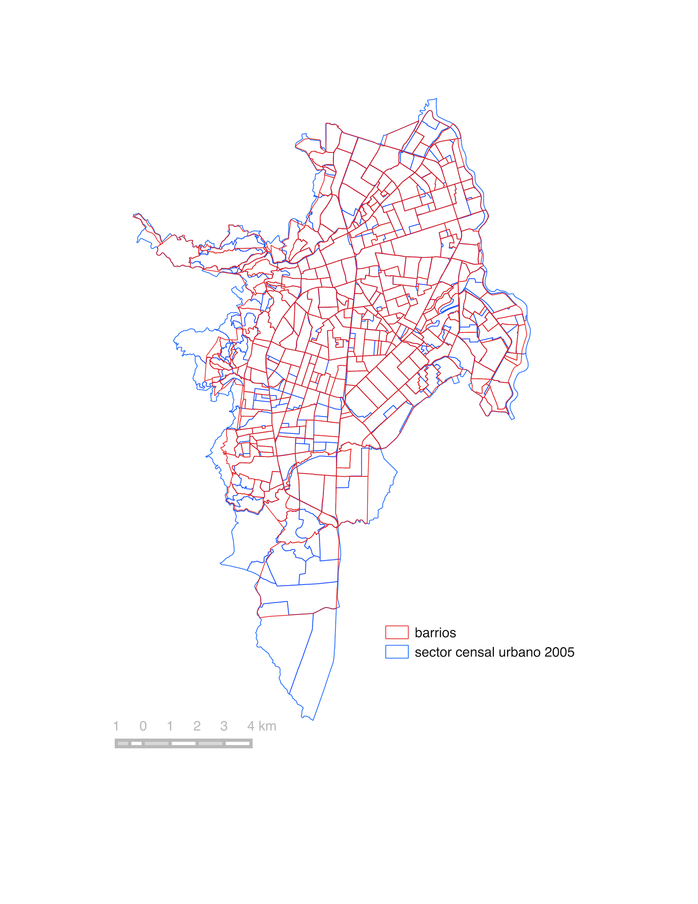

# Metodología {#meto}

```{r load-all, echo=FALSE}
#load(".RData")
```


## Aproximación general

Este trabajo se concentra en indagar en particular sobre la justicia ambiental distributiva por medio de modelos estadísticos, geoestadisticos apoyados por el análisis visual de los patrones espaciales. Para ellos se hará uso de datos del censo arbóreo de 2015^[ Desafortunadamente los datos del censo arbóreo no están disponibles al público general por motivos desconocidos, pues según la legislación Colombiana no existe ningún tipo de impedimento ni restricciones de privicidad sobre estos datos, que fueron recolectados con el auspicio de dineros públicos. Trabajé con una copia a la que tuve acceso por vinculos laborales con la Alcadía de Cali], el censo de población del 2005^[Disponibles en [@censo_sistema_dane; @dane_cepal_celade_2005; @geoportal_DANE]] y aspectos estructurales delentre el espacio público y privado de las unidades espaciales de análisis^[Disponibles en [@geoportal_idesc; @noauthor_plan_nodate]]. 

## Área de estudio

El municipio de Santiago de Cali se encuentra ubicado al suroccidente colombiano. Es la capital del departamento del Valle del Cauca y es la tercera ciudad más poblada del país, después de Bogotá y Medellín, con 2420114 habitantes segun Cali en Cifras 2015. El municipio tiene un área 561.7 Km2, un área del perímetro urbano 120.4 Km2 (21.4 %).(Ver figura \@ref(fig:ubicacion)).La división administrativa de la zona urbana son comunas y las comunas se componen de barrios. 
 

```{r ubicacion, out.width='100%',echo=FALSE, fig.cap="Área de estudio"}

```


Santiago  de Cali presenta dos  zonas topográficas:  el valle del río Cauca hacia el oriente, el terreno más plano donde se ubica el casco urbano, y la zona de piedemonte hacia el occidente sobre la margen derecha de la cordillera Occidental. El area urbana limita al oeste y sur con el área rural del municipio, al este con el río Cauca y los municipios de Palmira y Candelaria, y al norte con el municipio de Yumbo.

```{r googlemp, out.width='100%',echo=FALSE, fig.cap="Mapa de Santiago de Cali,tomada de Google Maps"}

```


El clima del municipio varía en relación al rango altitudinal que abarca entre 916 y 1,438 msnm. En la zona plana, se presenta un clima cálido con características semihúmedas hacia el sur y semiáridas hacia el norte mientras el piedemonte presenta condiciones de clima templado. La precipitación anual promedio es de 1.500 mm y la temperatura promedio anual es de 24 °C aproximadamente. (CIAT, 2015). La ciudad de Cali es de clima caliente, donde la sombra y la brisa son bien valoradas por sus habitantes. 


```{r satelite, out.width='100%',echo=FALSE, fig.cap="Vista satelital de Santiago de Cali,tomada de Google Maps"}

```

## Datos

### Datos de registros oficiales del municipio

La cartografía disponible en la Infraestructura de Datos Espaciales de Santiago de Cali, IDESC [@geoportal_idesc], incluye información sobre los objetos geográficos naturales, de infraestructura urbana, límites y divisiones político administrativas y la clasificación de predios en cuanto a espacio público disponibles en coordenadas planas del sistema [@noauthor_magna-sirgas-cali_nodate]. Además está la base de datos geográfica del Plan de Ordenamiento territorial de Cali 2014, POT2014^[Toda la información del POT2014 se encuentra en la web de la Alcaldía y puede descargarse como archivo GDB compatible con ArcGIS 10.4 o consumirse de Geoserver de IDESC como WFS o mapas en formato pdf del acuerdo]. Del POT2014 se seleccionaron conjuntos de datos de equipamientos y espacio público contenido en la estructura ecológica complementaria (ECC) que incluye cementerios, universidades, EV de acceso no restringido aunque algunos sea predios privados contenidos en EEC. De la IDESC se seleccionó la capa de barrios, espacio público, humedales, ríos y corredores ambientales disponibles vía WFS. 

En la figura \@ref(fig:capas-idesc) se muestra un mapa con las capas seleccionadas para el realizar el procesamiento y los análisis.

```{r capas-idesc, out.width='100%',echo=FALSE, fig.cap="Capas usadas para el procesamiento de los espacios verdes y las carateristicas de las manzanas"}
knitr::include_graphics("images/capas_idesc_pot2014.png")
```


### El censo arbóreo 

En el año 2015 la ciudad de Santiago de Cali (Colombia) concretó la realización de un censo arbóreo que dejó como resultado una base de datos de aproximadamente 290.000 individuos censados. Los datos dan cuenta de la identificación de especies, sus características dasométricas, de emplazamiento y estado fitosanitario. Estos datos constituyen un insumo fundamental para para la caracterización de los beneficios y cargas que supone el mantenimiento y desarrollo del arbolado urbano. De hecho, su realización ocurre en el marco del proceso de formulación del plan silvicultura urbana o estatuto arbóreo^[ El proyecto de censo arbóreo se formuló en dos fases;  la primera se ejecutó mediante convenio No 095 de 2013 entre la CVC y la Universidad Autónoma de Occidente, y la segunda fase mediante convenio No 049 de 2014 entre las mismas entidades. Los datos no se encuentran publicados y fueron solicitados mediante un derecho de petición.] (Acuerdo 0335 de 2013). Las variables biofísicas recolectadas y la georeferenciación de los individuos permite agregar las características del arbolado a diferentes escalas de las unidades administrativas p.e divisiones censales, para identificar y caracterizar su distribución espacial y correlación con variables sociales o/y económicas. Las variables seleccionadas se resumen en la tabla \@ref(tab:vars-AU) y en la tabla \@ref(tab:datos-ca2015).

Table: (#tab:vars-AU) Variables para caracterizar el AU

| variable | {valores}[unidades]     |
|-----:|---------------------------:|
|id_arbol|número entero único|
|diametro copa|[m^2^]|
|altura arbol|[m]|
|vitalidad|{`r levels(AU_analsis$vitalidad) %>% as.character %>% str_c(.,collapse =", ")`}|
|edad|{`r levels(AU_analsis$edad) %>% as.character %>% str_c(.,collapse =", ")`}|
|emplazamiento|{`r levels(AU_analsis$emplazamiento) %>% as.character %>% str_c(.,collapse =", ")`}|
|vegetación|{`r levels(AU_analsis$vegetacion) %>% as.character %>% str_c(.,collapse =", ")`}|
|Este|[m] MAGNA - SIRGAS-CALI|
| Norte | [m] MAGNA - SIRGAS-CALI|


```{r datos-ca2015}
knitr::kable(head(AU_analsis[,c("id","vegetacion","edad","emplazamiento","diametro_copa","altura_arbol")]),caption = "Muestra de los datos del censo arbóreo",align = 'r')

```


Los árboles incluidos en el censo arbóreo de 2015 están separados por 10 años de los datos de caracterización socioeconómica y de la características de ocupación de los sectores urbanos. Esta brecha puede cerrarse un poco excluyendo los árboles catalogados como jóvenes. Otro factor que ayuda a matizar la distancia entre los datos de ambos censos es que el AU se desarrolla lento y los tamaños actuales de las copas y las alturas de los árboles, aunque son mayores que en el 2005, hablan del potencial que desarrollaron esas zonas. Dado que esa es la disponibilidad de datos poblacionales hay que asumir estas diferencias.  Finalmente, para este trabajo usaremos árboles, palmas y bambú de más de 1.9 m de altura (descartando arbustos y plantas arbustivas) para garantizar que son individuos que proveen sombra a los transeúntes. 

En la siguiente figura \@ref(fig:capa-ca2015sel) se observa todos los arboles seleccionados para el analsis. 

```{r capa-ca2015sel, fig.cap="Árboles seleccionados para el análisis. El tamaño de puntos que representan los arboles es proporcional al area de la copa en unidades del mapa."}


```


###El censo de población

El último censo de población en Colombia se realizó en el año 2005, y los datos se pueden consultar y agregar en las diferentes unidades censales (sector, sección, manzana) usando una sistema de consulta web de censos Redatam^[El sistema de consulta es el [@cepal_redatam_nodate], que se puede acceder directamente desde [@dane_cepal_celade_2005] y en la página web del [DANE](http://www.dane.gov.co/index.php/estadisticas-por-tema/demografia-y-poblacion/censo-general-2005-1) dónde está organizada la documentación metodológica y otros servicios del censo.]. Estos datos sirven para caracterizar la población con base en indicadores y rasgos de las personas, aspectos sobre el uso del suelo y los tipos de vivienda. Las variables disponibles para el análisis están resumidas en las tablas \@ref(tab:vars-poblacion) y \@ref(tab:vars-vivienda). 

El otro componente de los datos es la cartografía censal del DANE [@geoportal_DANE] disponible para las diferentes unidades espaciales de agregación en el sistema de coordenadas WGS84. Para el análisis se tiene en cuenta todos las unidades censales que se interceptan con el perímetro urbano disponible en la IDESC, pues el censo arboreo se limito al este prerímetro.(ver figura \@ref(fig:su-periurbano))


Table: (#tab:vars-poblacion) Variables sobre la población 

| variable | {valores}[unidades]    |
|-----:|---------------------------:|
|Pertenencia Étnica|[personas]{indígenas, ROM, gitanos, raizales del Archipiélago de San Andrés, Providencia y Santa Catalina, palenqueros de San Basilio, afrocolombianos}
|Con alguna limitación|[personas]{sí,no}
|Con estudios superior o postgrado|[personas] |
|Ningún estudio|[personas] |

```{r su-periurbano, out.width='100%',echo=FALSE, fig.cap="División en barrios y sectores urbanos de Santiago de Cali"}
knitr::include_graphics("images/sectoresurbanos_perimetro_idesc.png")
```

Table: (#tab:vars-vivienda) Variables sobre la las viviendas 

| variable | {valores}[unidades]    |
|-----:|---------------------------:|
|tipo vivienda|[viviendas] {Casa,Casa indígena,Apartamento,Tipo cuarto,Otro tipo de vivienda}|
|uso vivienda|[predio]{Uso Vivienda.Uso Unidad Económica,Uso LEA}|
|cantidad predios|[predios]|
|cantidad viviendas|[viviendas]|

Una de las apuestas del proyecto es incluir aspectos de los procesos de desarrollo urbano a través de la idea de barrio: como unidad de identidad cultural urbana y estructural, de características físicas y habitacionales en las que confluyen las transformaciones que hacen los habitantes y los diseños urbanos e intervenciones arquitectónicas de los planeadores y constructores en la ciudad. Sin embargo, la información socioeconómica disponible está en unidades de la cartografía censal del 2005, que no coincide exactamente con los límites de barrios. Un primer supuesto es que los sectores censales aproximan bien a los barrios, pues las diferencias no tan drmaticas (ver figura \@ref(fig:su-barrios)). La unidad espacial de análisis sobre la cual se harán todas las agregaciones el sector urbano (SU) de la cartografía censal 2005.

```{r su-barrios, out.width='100%',echo=FALSE, fig.cap="División en barrios y sectores urbanos de Santiago de Cali"}

```

Los demás conjuntos de datos, cuyos elementos sobrepasen los límites del centro poblado conformado por los SUs seleccionados son preprocesados para excluir los datos y zonas fuera del perímetro conformado por los SUs. 

## Métodos y técnicas

El análisis propuesto se compone de las siguientes actividades:
 
1.  Preparación de los datos: una tarea común pero crucial para el análisis de datos. La estandarización de las variables categóricas y la identificación de valores atípicos o inconsistentes es una base firme para la estimación de parámetros y obtener soluciones confiables y sensibles de interpretación. Los datos suelen estar usualmente en formatos para la lectura humana o con distinta estructura de las variables de los modelos. La preparación de los datos consume la mayor parte de los esfuerzos de las tareas de procesamiento de los datos. Los datos del censo arbóreo se encuentra en tablas bien conformadas lo que facilita su manipulación. Los datos de consulta del censo de población vienen en tablas independientes para cada unidad espacial seleccionada, con diferentes longitud de variables. A esto se suma el componente espacial, donde hay que prestar particular atención a los sistemas de coordenadas y usar coordenadas planas consistentes con las unidades de espacio.
1.  Procesamiento y análisis estadístico: cálculo de indicadores de cobertura, acceso y variables socioeconómicas. Cálculo de estadísticos para probar normalidad, normalización de las variables e indicadores, cálculos de coeficientes de correlación Pearson y de Spearman entre todos los pares de variables.
1. Inspección visual de los datos: hacer uso de gráficas estadísticas, mapeos y mapas para evaluar y seleccionar los indicadores a usar en un modelo de regresión lineal. 
1. Evaluar los residuos usando la prueba de correlación espacial de Moran’I usando al menos dos diseños de matriz W. Si la prueba muestra una correlación y un valor de significancia alta, se prueban modelos tipo SAR, SEM o SLX para comparar su desempeño. 
1. Selección del modelo que mejor se ajusta usando métricas de error y de ajuste como R2 y el criterio de Akaike.


```{r diagrama-met}

```

